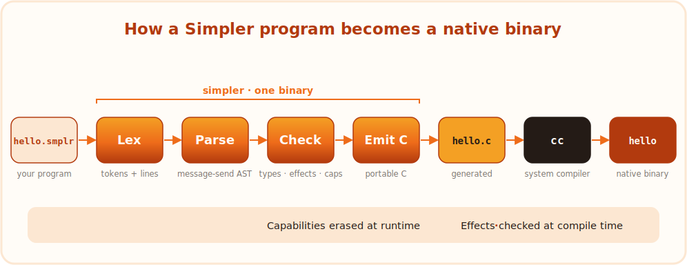

# Simpler


**A programming language whose only goal is to be simple.**


Simple to learn, simple to read, simple for an AI to write, simple to install,
simple to upgrade. Compiled, and fast. Every feature must pay for itself in
problems solved, or it does not go in.

<br clear="left"/>

## The idea

**Everything is a message send.** A field read, a method call, an operator: all
one thing, `receiver.name(arguments)`. There is essentially one grammar
production, and that is the point. Four pieces of punctuation carry the syntax,
with zero overlap:

| Symbol | Means |
|--------|-------|
| `=` | bind a value to a name |
| `:` | ascribe a type |
| `{ }` | delimit a block |
| `.` | send a message |

The rest follows from a few committed decisions:

- **Effects live in the type, not the syntax.** Pure by default; anything that
  touches the world is marked (`!IO`, `!Fail`). A pure function cannot call an
  effectful one without saying so, so cost stays visible at every call site.
- **Capabilities replace imports.** There are no globals. `main` receives the
  world and passes subsets down, so a signature becomes a permission list: a
  function can only touch what it was handed.
- **Value semantics, no GC.** No garbage collector (no pauses, no idle battery
  drain) and no borrow checker (nothing hard to learn). Capabilities are erased
  at compile time, so the permission system costs nothing at runtime.
- **Compiled via C.** The compiler transpiles to C and hands it to the system C
  compiler, which buys a mature optimizer and every platform for free.

The full reasoning, including why it is built to be written by an AI, is in
[the spec](SPEC.md) and [the book](Simpler.pdf).

## A taste

```
main(sys) {
  greet(sys.screen, "world")
}

// greet may ONLY use the screen it was handed, and must declare !IO.
greet(screen : Screen, who : Str) !IO {
  screen.print("hello,")
  screen.print(who)
}
```

`greet`'s signature is its whole world: it holds a `Screen` and a `Str`, it
declares the `!IO` effect, and it can reach nothing else. Drop the `!IO` and the
compiler refuses to build it. Reach for a capability you were not handed, and
the name is simply not in scope.

## How it compiles

<p align="center"></p>

The compiler is one small binary. It lexes your source into tokens, parses
them into a tree of message-sends, checks types, effects, and capabilities,
then emits portable C and hands it to the system C compiler. Effects and
capabilities are compile-time only, so they cost nothing at runtime.

## Try it

**No Rust required.** The compiler is now written in Simpler. Its source is
transpiled to C and committed as [`selfhost/simpler.c`](selfhost/simpler.c), so a
plain C compiler bootstraps the whole language:

```bash
cd selfhost
./build.sh            # cc simpler.c -> ./simpler  (no Rust)
./build.sh --rebuild  # then ./simpler recompiles its own source and proves the fixpoint
```

To compile a program, the self-hosted compiler reads `input.smplr` and writes C
to stdout:

```bash
cp sample.smplr input.smplr && ./simpler > out.c && cc out.c -o out && ./out
```

It compiles real tools, not just itself. [`selfhost/linenum.smplr`](selfhost/linenum.smplr)
reads a file, numbers its lines, and writes the result, the read-transform-write
shape most command-line tools have:

```
main(sys) {
  src = sys.files.read("in.txt")?
  sys.files.write("out.txt", number(src))
}
```

`number` is a pure `Str -> Str` function, so only `main` ever touches the disk.
A function that called `.write` without declaring `!IO` would be rejected.

The original **Rust bootstrap** still lives in [`bootstrap/`](bootstrap/) as the
fuller reference (it also checks effects and exhaustiveness, and provides `fmt`
and `test`), but the language no longer depends on it:

```bash
cd bootstrap
cargo build --release
./target/release/simpler run examples/m3.smplr      # build and run
./target/release/simpler emit examples/m3.smplr     # show the generated C
```

Commands: `run`, `build`, `emit`, `fmt` (format in place, canonical and
comment-preserving), and `test` (run the file's `test_*` functions).

## Development

The compiler has its own regression harness: golden output for every example,
expected error messages for known-bad programs, `fmt` idempotence, and the
`test` runner. One command, green or red:

```bash
cd bootstrap
./run-tests.sh
```

## Status

**Self-hosting and Rust-free.** It grew one runnable milestone at a time, from the
first lexer to a compiler that compiles itself:

- [x] **M1** the spine: lex, parse, emit C, compile end to end
- [x] **M2** integers, the seven operators, locals, `if`/`else`, `n.times`, typed `print`
- [x] **M3** effects (`!IO`/`!Fail`), capabilities, user functions, all checked
- [x] **M3b** `?` failure propagation, the `Files`/`Mail` capabilities, named arguments
- [x] **M3c** value-returning user functions and cross-function `?`
- [x] **M4a** the canonical `fmt` formatter (comment-preserving, idempotent)
- [x] **M4b** the `test` runner with the `assert` built-in
- [x] **M5a** user-defined record types (`type { fields }`, value-semantic C structs)
- [x] **M5b** variants and exhaustive `match` (tagged unions)
- [x] **M5c.1** built-in value methods (`Str`/`Int`/`Bool` ops, `Bool` literals, `Str` equality)
- [x] **M5c.2** recursive variants via heap-boxing, multi-payload cases (a type can hold itself)
- [x] **M5c.3** `match` as a value (recursive evaluators: `Add(a, b) -> eval(a) + eval(b)`)
- [x] **M5c.4** lists (`[…]`, `push`, `length`, `at`, `each`; elements of any type)
- [x] **M6** `while`, a general loop (the one control-flow shape a scanner needs)
- [x] **Self-host** ✅ **the compiler is written in Simpler and compiles itself.**
  [`selfhost/simpler.smplr`](selfhost/simpler.smplr) runs the whole pipeline, lex to
  parse to C, and reaches the three-stage byte-identical fixpoint: the bootstrap
  builds it, it compiles its own source, and that output compiles its own source
  to a byte-for-byte identical result. The harness checks this on every run. It
  was grown one runnable step at a time, each verified against the bootstrap:
  - [x] **lexer** the full Simpler token set: identifiers, ints, strings with escapes, comments, every operator including `->` and `==`
  - [x] **variant types and `match`** payload-less cases as a C enum; payload-bearing cases boxed in a uniform `{tag, slots}` object, so recursive and multi-field cases (`Add(Expr, Expr)`) just work; match bindings read each payload back by position
  - [x] **functions, calls, locals, arithmetic, `print`** an AST out as C that builds and runs; it already compiles a recursive tree evaluator
  - [x] **`if`/`else`, `while`, comparisons** with reassignment (locals hoisted so a binding can be reused)
  - [x] **record types and field access** real C structs, resolved through a local type environment (variable to type), the front half of the checker
  - [x] **typed params/returns and `Str` methods** string literals, `.concat`/`.length`/`.at`/`.code`/`.slice`/`.toStr`, string `==`, and `print` choosing `%s` or `%ld`, all dispatched on inferred types
  - [x] **`List` methods** list literals, `.push`/`.at`/`.length` (disambiguated from `Str` by receiver type), and `.each { x in ... }` lowered to a counted C loop, over a growable-list runtime
  - [x] **typed record fields** each field's declared type is stored and resolved, so a `Str` field picks `s_eq` and a `List` field picks `l_len`, the way the compiler reads its own AST
  - [x] **capabilities** `main(sys)` becomes C `int main()`, and `sys.screen.print(x)` lowers like the built-in print (the erased capability path drops out, only the print remains)
  - [x] **string re-escaping** literals are re-escaped on emit (`\n`, `\"`, `\\`, `\t`, `\r`), so a string with a newline survives the round trip into valid C
  - [x] **reading its own source** (`sys.files.read`, `?`), typed match bindings, and nested-binding type inference, the last gaps the fixpoint exposed
  - [x] **the three-stage byte-identical fixpoint** ✅ stage2 and stage3 match to the byte
- [x] **Beyond the bootstrap** the self-hosted compiler is now a superset of the
  Rust on what it rejects: it catches every type-, structure-, and effect-level
  error the Rust does, with source locations, and still compiles itself to the
  byte-stable fixpoint. (Adding a check means the compiler now needs to *report*
  errors, so its source uses a `fail` primitive the frozen Rust does not have;
  from here it is built only from its own C seed.) The lone gap left to the C
  compiler is using a capability that was never handed in (an undefined name).
  - [x] **error reporting** a `fail` primitive: a compile error prints to stderr and stops the compiler
  - [x] **`match` exhaustiveness** every case of the matched variant must have an arm, else a compile error
  - [x] **operand types** arithmetic and ordering (`+ - * / < >`) require Int operands; `1 + "a"` is rejected
  - [x] **argument types** a call checks each argument against the parameter's declared type; `greet(5)` where `greet` wants a `Str` is rejected
  - [x] **record field types** a constructor checks each field value against its declared type; `Point(x = 1, y = "a")` is rejected
  - [x] **return types** a function's value must match its declared return type; `twice(n) : Int { "no" }` is rejected (`match`-bodied functions are skipped, their type is not inferred)
  - [x] **match arity** each arm binds exactly as many payloads as its case carries; `Add(a)` where `Add` has two is rejected
  - [x] **source locations** every error reports `input.smplr:<line>:`, the line of the enclosing function (the lexer tracks a line per token; the Rust pinpoints the exact expression, this is one notch coarser)
  - [x] **effects** `!IO`/`!Fail` coverage: a function must declare every effect it uses, directly through a capability call (`.print`/`.read`/`.send`) or transitively by calling an effectful function; `main` is exempt. Capabilities are typed (`sys.screen` is a `Screen`, erased to `0` at runtime) so they pass to capability parameters. The one piece left to the C compiler: using a capability that was never handed in is caught as an undefined name, not yet as a Simpler-level error.

See it for yourself, the fixpoint with no Rust at all:

```bash
cd selfhost
cc -O2 simpler.c -o simpler   # build the compiler from its committed C seed
cp simpler.smplr input.smplr
./simpler > stage2.c          # the Simpler compiler compiles its own source
cc stage2.c -o stage2
./stage2 > stage3.c           # and that compiler compiles it again
diff simpler.c stage2.c       # identical: the fixpoint
```

The first brick, [`selfhost/calc.smplr`](selfhost/calc.smplr), is still here too:
a tiny lex-parse-fold pipeline that reads an expression and emits C, the idea in
miniature.

## Read more

- **[SPEC.md](SPEC.md)** the language in full
- **[PLAN.md](PLAN.md)** how it gets built, milestone by milestone
- **[DESIGN.md](DESIGN.md)** the visual and verbal language
- **[Simpler.pdf](Simpler.pdf)** all of the above as a short book

## License

[Unlicense](LICENSE), public domain. By Geir Isene.
